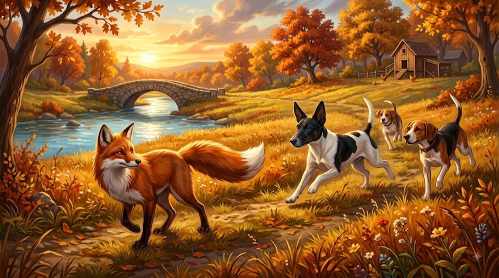
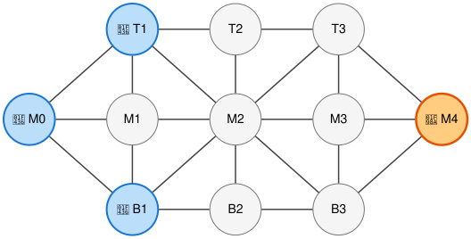
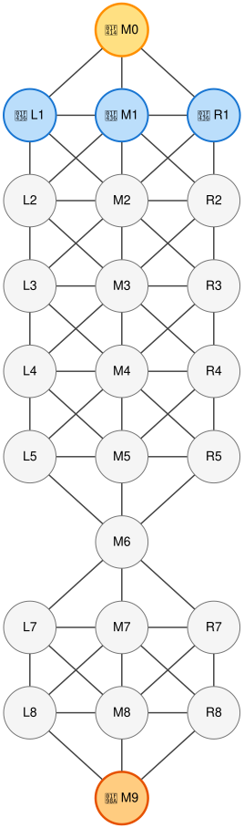

# Fox and Hounds

<p align="center">
  
</p>

<p align="center">
  <a href="https://play.google.com/store/apps/details?id=org.dymka.foxandhounds"
    ></a>
  <a href="https://www.dymka.org/foxandhounds/"
    ></a>
</p>

A turn-based asymmetric pursuit-evasion game played on arbitrary graph topologies, featuring both
the traditional [Classic board](https://en.wikipedia.org/wiki/Hare_games) (*Hare and Hounds*) and
custom campaign maps like *The River Crossing*.

One clever **Fox** ($\text{F}$) matches wits against a pack of **$N$ Hounds** ($\text{H}_1,
\text{H}_2, \dots, \text{H}_N$). The Fox aims to slip past the pack and infiltrate the **Chicken
Coop**, while the Hounds must coordinate as a cohesive unit to encircle and immobilize the Fox.

## 📖 Game Rules & Mechanics

### 1. Board as a Graph
- The game is played on an undirected graph $G = (V, E)$, where:
  - **Vertices ($V$)**: Discrete positions where pieces stand.
  - **Edges ($E$)**: Valid pathways connecting adjacent vertices.

### 2. Turn Order & Flow
- The game is strictly **turn-based**.
- **Fox Moves First**: The Fox takes turn 1, followed by the Hounds.
- **Single Piece Movement**:
  - On the **Fox's turn**: The Fox moves to an adjacent, unoccupied vertex.
  - On the **Hounds' turn**: The Hounds' player selects and moves **exactly one Hound**
    to an adjacent, unoccupied vertex.

### 3. Movement Rules
- **Movement Directionality**:
  - **Classic**: The Fox moves in any connected direction. Hounds **cannot retreat** backwards
    toward the Coop (they can only advance or move sideways).
  - **The River Crossing**: Unrestricted bidirectional traversal for all pieces along connected
    edges (forward, backward, or sideways).
- **Step Size**: Exactly one edge traversal per turn.
- **Occupancy & No Collisions**:
  - No two pieces may occupy the same vertex simultaneously.
  - Pieces cannot jump over or pass through occupied vertices.
- **No Captures**:
  - Pieces cannot be captured or eliminated. The game is purely positional and tactical.
- **Chicken Coop Sanctuary**:
  - **Hounds cannot enter the Chicken Coop (`M0`)**. The Chicken Coop is strictly an infiltration
    target for the Fox.

### 4. Victory Conditions
| Faction | Objective / Victory Condition |
| :--- | :--- |
| 🦊 **Fox** | Reaches the **Chicken Coop** (or Hounds have no legal moves remaining). |
| 🐶 **Hounds** | **Completely traps** the Fox such that the Fox has **zero legal moves**. |

## 🗺️ Board Variants

### 1. Classic ("Hare and Hounds")

Based on traditional [Hare games](https://en.wikipedia.org/wiki/Hare_games) (also known as *Hare
and Hounds*, *French military game*, or *The Soldiers' Game*), an asymmetric pursuit game studied
in combinatorial game theory. Played on an 11-node spearhead board where hounds cannot retreat.

#### Graph Architecture
- **Apex Left / Column 0** (`M0`): The Chicken Coop goal vertex and starting post of Hound 1
  (1 vertex).
- **Column 1** (`T1`, `M1`, `B1`): Starting posts of Hound 2 (`T1`) and Hound 3 (`B1`) (3 vertices).
- **Column 2** (`T2`, `M2`, `B2`): Central junction with diagonal cross-tracks passing through `M2`
  (3 vertices).
- **Column 3** (`T3`, `M3`, `B3`): Flanking defensive line before the den (3 vertices).
- **Apex Right / Column 4** (`M4`): The Fox Den start vertex (1 vertex).

#### Board Graph Visualization

<p align="center">
  
</p>

#### Level Specifications

- [Graphviz DOT Specification](docs/board_graph_classic.dot) — Classic level topology definition.

### 2. "The River Crossing" (3x9 Bottleneck)

A tactical campaign map featuring open flanking grounds, a river bottleneck bridge on Row 6,
and the Chicken Coop behind the Hounds' defensive line.

#### Graph Architecture
- **Row 0** (Goal): `M0` — The Chicken Coop target vertex (1 vertex).
- **Row 1** (Hounds Start): `L1`, `M1`, `R1` — Starting posts of the 3 Hounds (3 vertices).
- **Rows 2–5** (North Fields): 3 vertices per row (`L`eft, `M`iddle, `R`ight) with centrally
  symmetric diamond-grid connectivity.
- **Row 6** (The Bottleneck): `M6` — A single chokepoint bridge over the river connecting
  North and South fields (1 vertex).
- **Rows 7–8** (South Fields): 3 vertices per row (`L`eft, `M`iddle, `R`ight).
- **Row 9** (Fox Start): `M9` — The Fox Den start vertex (1 vertex).

#### Board Graph Visualization

<p align="center">
  
</p>

#### Level Specifications

- [Graphviz DOT Specification](docs/the_river_crossing.dot) — The River Crossing topology
  definition.

### 3. Future Variants

Additional historical board topologies and rule configurations are planned for future updates.
For reference on more variants to come, see Mats Winther's research on
[Hare Games](https://mats-winther.github.io/bg/haregames.htm).

## 🛠️ Build & Run Instructions

The game is built with [Rust](https://www.rust-lang.org/) and [Macroquad](https://macroquad.rs/),
supporting Native Desktop (macOS, Linux, Windows), Web (WebAssembly), and Android.

A [`Justfile`](Justfile) is provided for common development tasks.

### Prerequisites
- **Rust Toolchain**: Install via [rustup](https://rustup.rs/) (stable channel).
- **Just** (optional): Install with `cargo install just` or `brew install just`.

### 🖥️ 1. Native Desktop

Run the native game locally with audio and high-DPI windowing:

```bash
# Run directly
cargo run
# or with Just:
just run

# Build optimized release binary
cargo build --release
```

### 🌐 2. WebAssembly (Browser)

To build and run the game in the browser:

```bash
# Add WASM target
rustup target add wasm32-unknown-unknown

# Build WASM binary and prepare web assets
just install-wasm

# Serve locally at http://localhost:8080
just serve
```

Alternatively without `just`:
```bash
cargo build --target wasm32-unknown-unknown --release
cp target/wasm32-unknown-unknown/release/foxandhounds.wasm web/fox-and-hounds.wasm
python3 -m http.server 8080 -d web
```

### 📱 3. Android (APK & App Bundle)

#### Prerequisites
- Android SDK (API 36, Build-Tools 36.0.0) & NDK (r26+)
- `cargo-quad-apk`:
  ```bash
  cargo install --git https://github.com/not-fl3/cargo-quad-apk --force
  ```
- `bundletool` (for `.aab` builds): `brew install bundletool`

#### Building
```bash
# Build release APK
just build-android
# (or: cargo quad-apk build --release)

# Build Google Play release Android App Bundle (.aab) with R8 optimization
just build-aab
# (or: ./scripts/build-aab.sh)
```

### 🧪 4. Testing & Code Quality

```bash
# Run unit and integration tests
cargo test
# or: just test

# Run Clippy linter with strict checks
cargo clippy --all-targets -- -D warnings
# or: just clippy

# Format code
cargo fmt
# or: just fmt
```

## 🎯 Key Strategic Concepts

### For the Fox 🦊
1. **Bottleneck Timing**: The bridge at Row 6 (`M6`) is both a barrier and a launchpad.
   The Fox should feint on Row 7/8 to lure hounds out of formation before dashing through `M6`.
2. **Tempo & Flanking**: Draw two hounds toward one flank, then pivot through the symmetric
   diagonal connections to exploit the vacant opposite lane.
3. **Penetration Victory**: Once past the defensive line into Row 1, the Hound pack cannot
   recover if the Chicken Coop (`M0`) is within one move.

### For the Hounds 🐶
1. **Cohesive Wall Formation**: Hounds should advance in rank or hold key cross-lanes
   (`L`, `M`, `R`) to prevent the Fox from slipping between gaps.
2. **Bridge Lockout**: Controlling `M6` or establishing a blockade on Row 5 (`L5`, `M5`, `R5`)
   prevents the Fox from crossing the river.
3. **Corner Containment**: Drive the Fox toward boundary nodes (`L` or `R`) and collapse
   adjacent degrees of freedom to achieve checkmate (0 legal moves).
