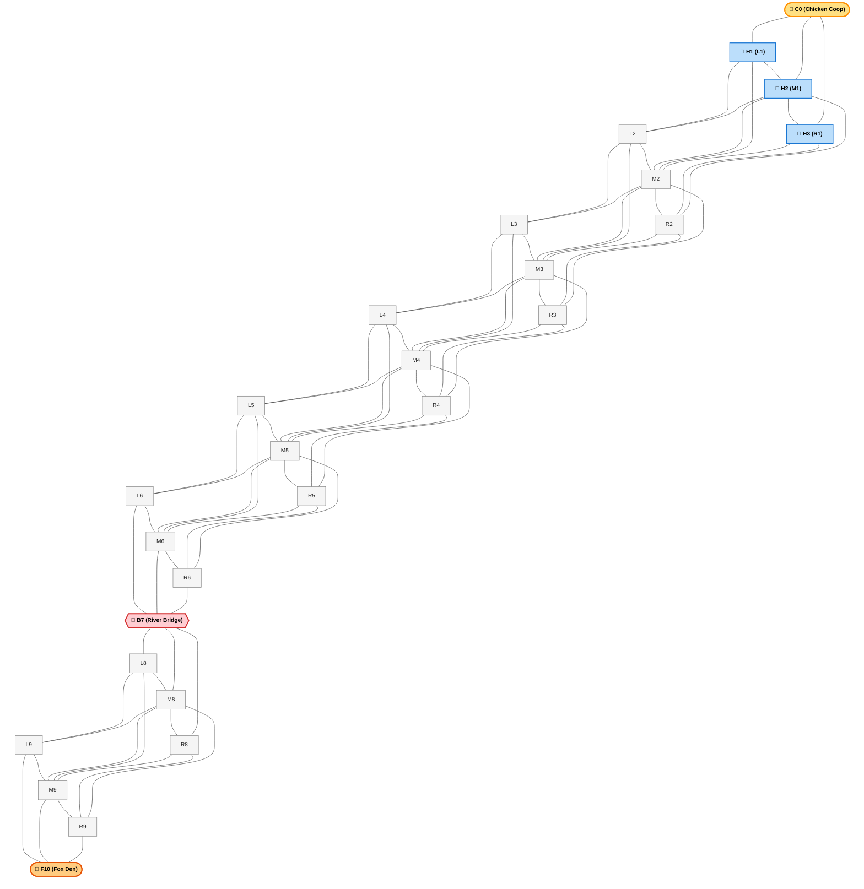
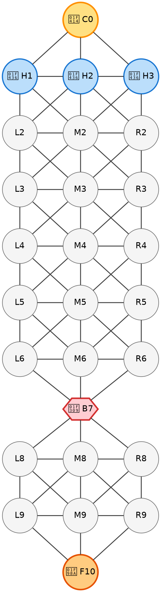

# Fox and Hounds (Лиса и Гончие)

A turn-based asymmetric pursuit-evasion game played on arbitrary graph topologies.

One clever **Fox** ($\text{F}$) matches wits against a pack of **$N$ Hounds** ($\text{H}_1, \text{H}_2, \dots, \text{H}_N$). The Fox aims to slip past the pack and infiltrate the **Chicken Coop**, while the Hounds must coordinate as a cohesive unit to encircle and immobilize the Fox.

---

## 📖 Game Rules & Mechanics

### 1. Board as a Graph
- The game is played on an undirected graph $G = (V, E)$, where:
  - **Vertices ($V$)**: Discrete positions where pieces stand.
  - **Edges ($E$)**: Valid pathways connecting adjacent vertices.

### 2. Turn Order & Flow
- The game is strictly **turn-based**.
- **Fox Moves First**: The Fox takes turn 1, followed by the Hounds.
- **Single Piece Movement**:
  - On the **Fox's turn**: The Fox moves to an adjacent, unoccupied vertex.
  - On the **Hounds' turn**: The Hounds' player selects and moves **exactly one Hound** to an adjacent, unoccupied vertex.

### 3. Movement Rules
- **Bidirectional Traversal**: Pieces can move along any connected edge (forward, backward, or sideways).
- **Step Size**: Exactly one edge traversal per turn.
- **Occupancy & No Collisions**:
  - No two pieces may occupy the same vertex simultaneously.
  - Pieces cannot jump over or pass through occupied vertices.
- **No Captures**:
  - Pieces cannot be captured or eliminated. The game is purely positional and tactical.

### 4. Victory Conditions
| Faction | Objective / Victory Condition |
| :--- | :--- |
| 🦊 **Fox** | Reaches the **Chicken Coop** vertex (located at the opposite end of the graph, behind the Hounds). |
| 🐶 **Hounds** | **Completely traps** the Fox such that the Fox has **zero legal moves** on its turn. |

---

## 🗺️ Featured Level: "The River Crossing" (3x10 Bottleneck)

A tactical campaign map featuring open flanking grounds, a river bottleneck bridge on Row 7, and the Chicken Coop behind the Hounds' defensive line.

### Graph Architecture
- **Row 0** (Goal): `C0` — The Chicken Coop target vertex (1 vertex).
- **Row 1** (Hounds Start): `H1`, `H2`, `H3` — Starting posts of the 3 Hounds (3 vertices).
- **Rows 2–6** (North Fields): 3 vertices per row (`L`eft, `M`iddle, `R`ight) with centrally symmetric diamond-grid connectivity.
- **Row 7** (The Bottleneck): `B7` — A single chokepoint bridge over the river connecting North and South fields (1 vertex).
- **Rows 8–9** (South Fields): 3 vertices per row (`L`eft, `M`iddle, `R`ight).
- **Row 10** (Fox Start): `F10` — The Fox Den start vertex (1 vertex).

---

### Mermaid Level Graph

> **Note on Layout Alignment**: Mermaid uses the Dagre ranking engine. To enforce that $L_i$, $M_i$, and $R_i$ stay strictly on the exact same horizontal level (same rank), each row is grouped with `direction LR` and styled with invisible containers (`fill:none,stroke:none`).



---

### Graphviz DOT Specification

For standard Graphviz tools, the layout uses explicit `{ rank=same; ... }` constraints to guarantee pixel-perfect horizontal rows:



---

## 📊 Level Data Specification (JSON Schema)

Structured graph representation matching the symmetric level layout for programmatic game engine loading:

```json
{
  "name": "The River Crossing",
  "description": "3x10 board with a river bottleneck on Row 7 and centrally symmetric diamond connectivity",
  "dimensions": {
    "rows": 11,
    "max_width": 3
  },
  "initial_state": {
    "fox_start": "F10",
    "hounds_start": ["H1", "H2", "H3"],
    "coop_targets": ["C0"],
    "current_turn": "Fox"
  },
  "nodes": [
    { "id": "C0", "row": 0, "col": 1, "type": "target_coop" },
    { "id": "H1", "row": 1, "col": 0, "type": "standard" },
    { "id": "H2", "row": 1, "col": 1, "type": "standard" },
    { "id": "H3", "row": 1, "col": 2, "type": "standard" },
    { "id": "L2", "row": 2, "col": 0, "type": "standard" },
    { "id": "M2", "row": 2, "col": 1, "type": "standard" },
    { "id": "R2", "row": 2, "col": 2, "type": "standard" },
    { "id": "L3", "row": 3, "col": 0, "type": "standard" },
    { "id": "M3", "row": 3, "col": 1, "type": "standard" },
    { "id": "R3", "row": 3, "col": 2, "type": "standard" },
    { "id": "L4", "row": 4, "col": 0, "type": "standard" },
    { "id": "M4", "row": 4, "col": 1, "type": "standard" },
    { "id": "R4", "row": 4, "col": 2, "type": "standard" },
    { "id": "L5", "row": 5, "col": 0, "type": "standard" },
    { "id": "M5", "row": 5, "col": 1, "type": "standard" },
    { "id": "R5", "row": 5, "col": 2, "type": "standard" },
    { "id": "L6", "row": 6, "col": 0, "type": "standard" },
    { "id": "M6", "row": 6, "col": 1, "type": "standard" },
    { "id": "R6", "row": 6, "col": 2, "type": "standard" },
    { "id": "B7", "row": 7, "col": 1, "type": "bottleneck" },
    { "id": "L8", "row": 8, "col": 0, "type": "standard" },
    { "id": "M8", "row": 8, "col": 1, "type": "standard" },
    { "id": "R8", "row": 8, "col": 2, "type": "standard" },
    { "id": "L9", "row": 9, "col": 0, "type": "standard" },
    { "id": "M9", "row": 9, "col": 1, "type": "standard" },
    { "id": "R9", "row": 9, "col": 2, "type": "standard" },
    { "id": "F10", "row": 10, "col": 1, "type": "fox_start" }
  ],
  "edges": [
    ["C0", "H1"], ["C0", "H2"], ["C0", "H3"],
    ["H1", "H2"], ["H2", "H3"],
    ["H1", "L2"], ["H2", "M2"], ["H3", "R2"],
    ["H1", "M2"], ["H3", "M2"], ["H2", "L2"], ["H2", "R2"],
    ["L2", "M2"], ["M2", "R2"],
    ["L2", "L3"], ["M2", "M3"], ["R2", "R3"],
    ["L2", "M3"], ["R2", "M3"], ["M2", "L3"], ["M2", "R3"],
    ["L3", "M3"], ["M3", "R3"],
    ["L3", "L4"], ["M3", "M4"], ["R3", "R4"],
    ["L3", "M4"], ["R3", "M4"], ["M3", "L4"], ["M3", "R4"],
    ["L4", "M4"], ["M4", "R4"],
    ["L4", "L5"], ["M4", "M5"], ["R4", "R5"],
    ["L4", "M5"], ["R4", "M5"], ["M4", "L5"], ["M4", "R5"],
    ["L5", "M5"], ["M5", "R5"],
    ["L5", "L6"], ["M5", "M6"], ["R5", "R6"],
    ["L5", "M6"], ["R5", "M6"], ["M5", "L6"], ["M5", "R6"],
    ["L6", "M6"], ["M6", "R6"],
    ["L6", "B7"], ["M6", "B7"], ["R6", "B7"],
    ["B7", "L8"], ["B7", "M8"], ["B7", "R8"],
    ["L8", "M8"], ["M8", "R8"],
    ["L8", "L9"], ["M8", "M9"], ["R8", "R9"],
    ["L8", "M9"], ["R8", "M9"], ["M8", "L9"], ["M8", "R9"],
    ["L9", "M9"], ["M9", "R9"],
    ["L9", "F10"], ["M9", "F10"], ["R9", "F10"]
  ]
}
```

---

## 🎯 Key Strategic Concepts

### For the Fox 🦊
1. **Bottleneck Timing**: The bridge at Row 7 is both a barrier and a launchpad. The Fox should feint on Row 8/9 to lure hounds out of formation before dashing through `B7`.
2. **Tempo & Flanking**: Draw two hounds toward one flank, then pivot through the symmetric diagonal connections to exploit the vacant opposite lane.
3. **Penetration Victory**: Once past the defensive line into Row 1, the Hound pack cannot recover if the Chicken Coop (`C0`) is within one move.

### For the Hounds 🐶
1. **Cohesive Wall Formation**: Hounds should advance in rank or hold key cross-lanes (`L`, `M`, `R`) to prevent the Fox from slipping between gaps.
2. **Bridge Lockout**: Controlling `B7` or establishing a blockade on Row 6 (`L6`, `M6`, `R6`) prevents the Fox from crossing the river.
3. **Corner Containment**: Drive the Fox toward boundary nodes (`L` or `R`) and collapse adjacent degrees of freedom to achieve checkmate (0 legal moves).
